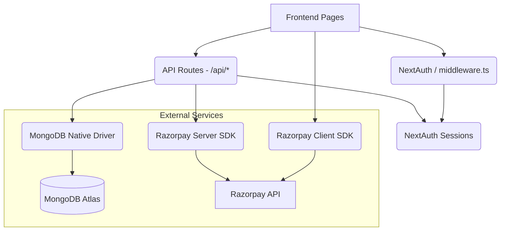

# Repository Map

## Folder Structure

```
humors-hub/
├── components/           # Reusable UI components
│   ├── admin/            # Admin-specific components (e.g., SiteCMS.tsx)
│   ├── Avatar.tsx
│   ├── ErrorBoundary.tsx
│   ├── Footer.tsx
│   ├── LoadingSpinner.tsx
│   ├── Navbar.tsx
│   ├── ParticleBackground.tsx
│   ├── Profile.tsx
│   ├── Ticket3D.tsx
│   ├── TicketPDF.tsx
│   └── UserDownloadPDF.tsx
├── lib/                  # Shared backend utilities
│   └── mongodb.ts        # Database connector
├── pages/                # Next.js Pages Router frontend & backend
│   ├── admin/            # Admin dashboard
│   ├── api/              # Backend API endpoints
│   │   ├── admin/        # Admin endpoints (bookings, users, cms, etc.)
│   │   ├── auth/         # NextAuth integration
│   │   ├── bookings/     # Booking endpoints
│   │   ├── cms/          # CMS endpoints
│   │   ├── comedians/    # Comedian application endpoints
│   │   ├── images/       # Image serving/upload endpoints
│   │   ├── payments/     # Razorpay payment endpoints
│   │   ├── user/         # User profile endpoints
│   │   └── users/        # General user endpoints
│   ├── auth/             # Authentication pages (login, signup, error)
│   ├── about.tsx
│   ├── book-tickets.tsx
│   ├── dashboard.tsx
│   ├── gallery.tsx
│   ├── index.tsx
│   ├── perform-with-us.tsx
│   ├── policies.tsx
│   ├── profile.tsx
│   └── shows.tsx
├── public/               # Static assets
├── scripts/              # Independent utility scripts (e.g., init-db.ts)
├── styles/               # Global CSS files
├── types/                # TypeScript type definitions
└── utils/                # General utilities
    ├── constants.ts
    ├── db-safe.ts
    ├── format.ts
    ├── gridfs.ts
    └── mongodb.ts        # Duplicate database connector
```

## Important Files

*   `package.json`: Project dependencies and scripts.
*   `middleware.ts`: Next.js edge middleware for route protection based on roles/authentication.
*   `next.config.js`: Next.js configuration settings.
*   `vercel.json`: Vercel deployment configuration, handling security headers and redirects.
*   `lib/mongodb.ts` & `utils/mongodb.ts`: MongoDB native driver initialization and caching.
*   `pages/api/auth/[...nextauth].ts`: NextAuth configuration for user session management.

## Dependency Graph



## Frontend → Backend Relationships

### Booking Flow
*   **Frontend**: `pages/book-tickets.tsx`
*   **Backend**: 
    *   `/api/payments/create-order` (Initializes Razorpay order)
    *   `/api/payments/verify` (Verifies Razorpay payment signature & creates booking)

### Authentication Flow
*   **Frontend**: `pages/auth/login.tsx`, `pages/auth/signup.tsx`
*   **Backend**: 
    *   `/api/auth/[...nextauth].ts` (NextAuth endpoints)
    *   `/api/auth/signup.ts` (Custom signup logic)
*   **Middleware**: `middleware.ts` (Route protection)

### User Dashboard & Profile Flow
*   **Frontend**: `pages/dashboard.tsx`, `pages/profile.tsx`
*   **Backend**: 
    *   `/api/user/update-profile.ts`
    *   `/api/users/profile.ts`
    *   `/api/users/change-password.ts`

### Admin Flow
*   **Frontend**: `pages/admin/index.tsx` (and `components/admin/SiteCMS.tsx`)
*   **Backend**:
    *   `/api/admin/bookings.ts`
    *   `/api/admin/users.ts`
    *   `/api/admin/payments.ts`
    *   `/api/admin/comedians.ts`
    *   `/api/admin/cms/content.ts`

### Performer Applications
*   **Frontend**: `pages/perform-with-us.tsx`
*   **Backend**:
    *   `/api/comedians/register.ts`
    *   `/api/comedians/approved.ts`
